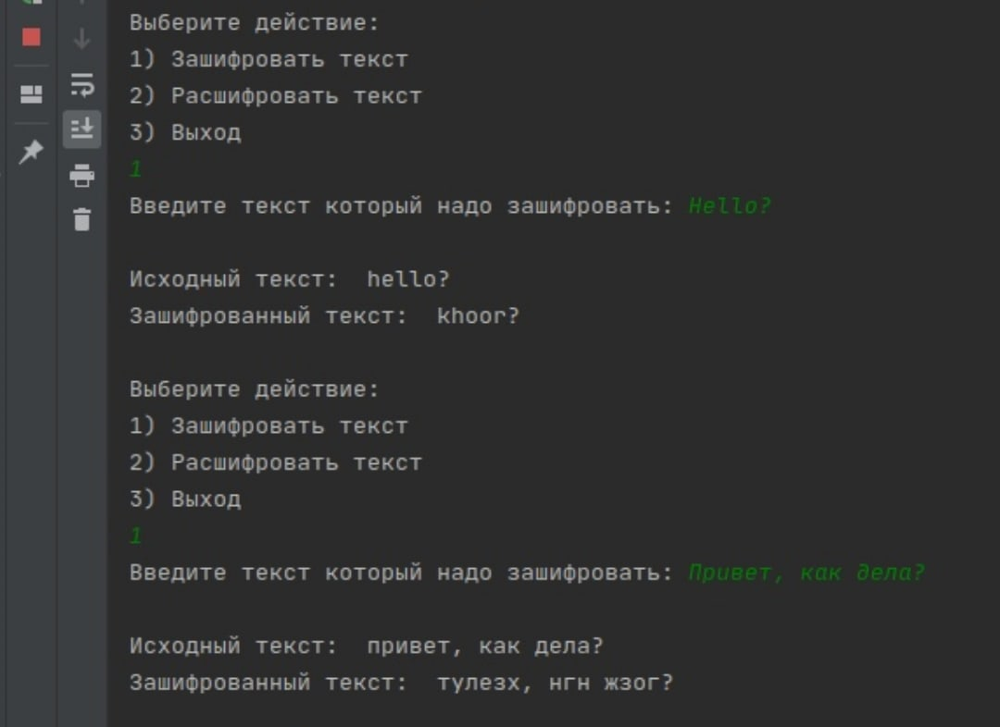
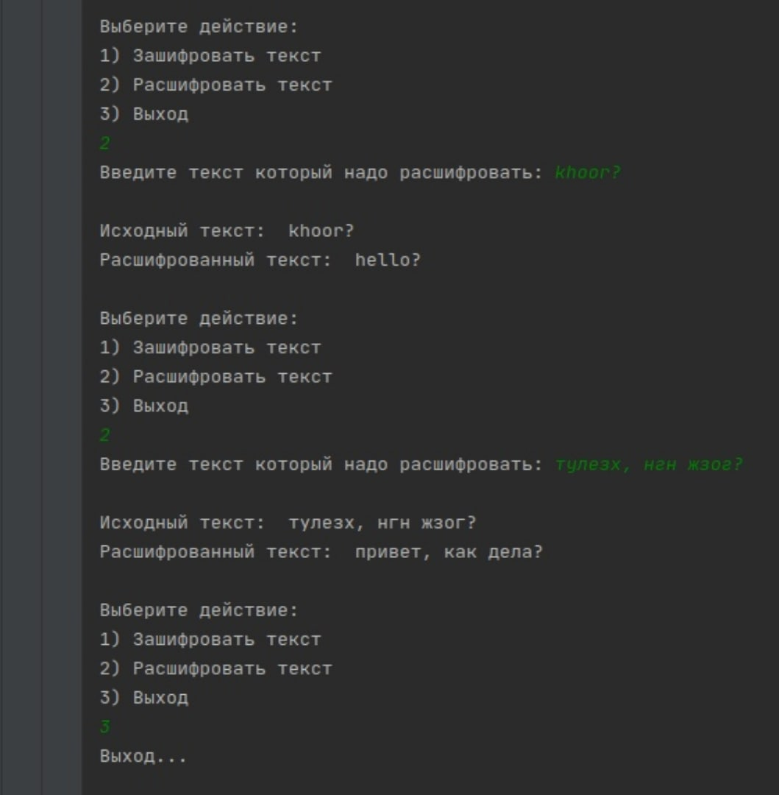

Программа зашифровывает либо расшифровывает введенный пользователем текст.

Проект можно открывать в среде программирования Pycharm. Файл написан на языке python. Открывать файл "Caesar's cipher.py". 
